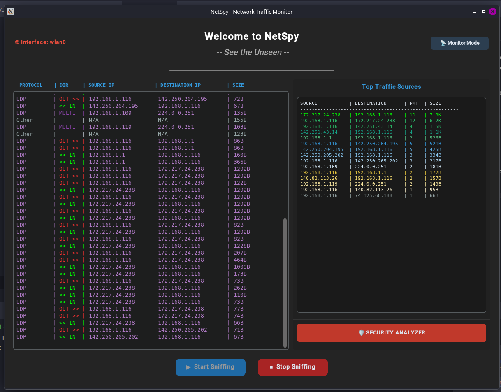
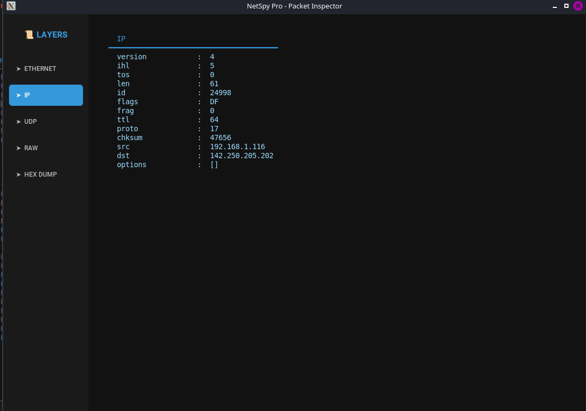
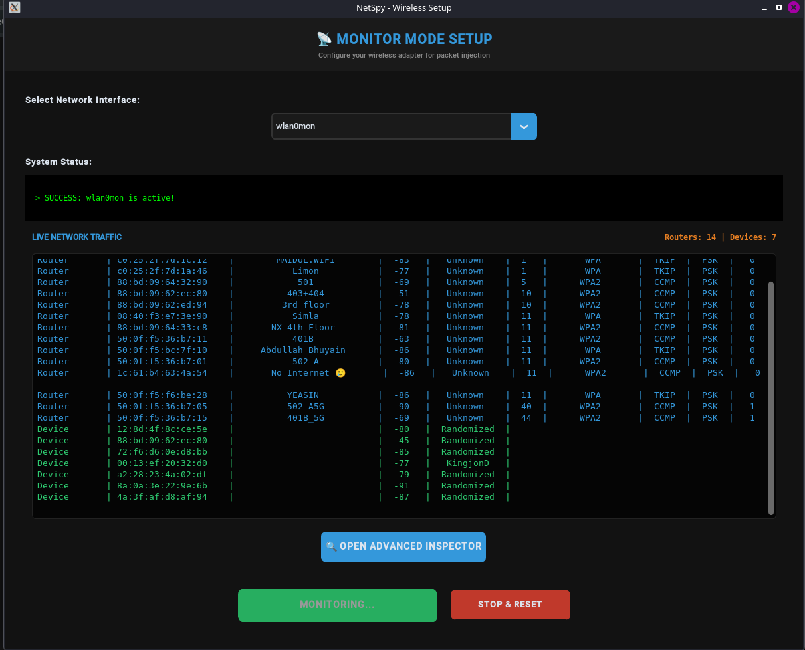
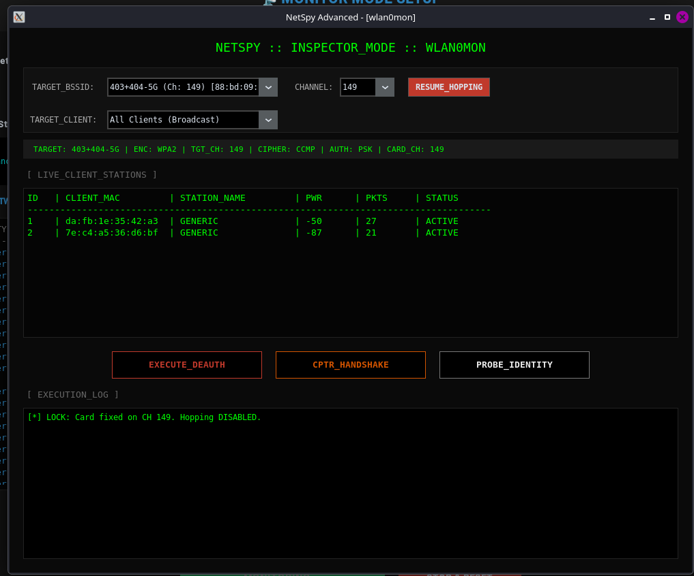
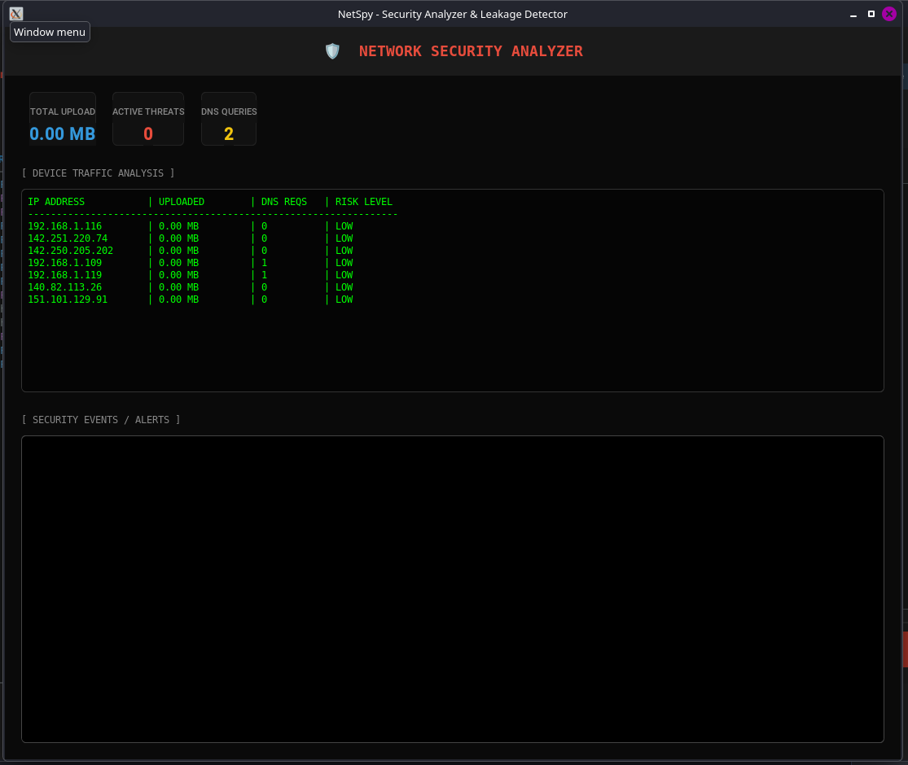
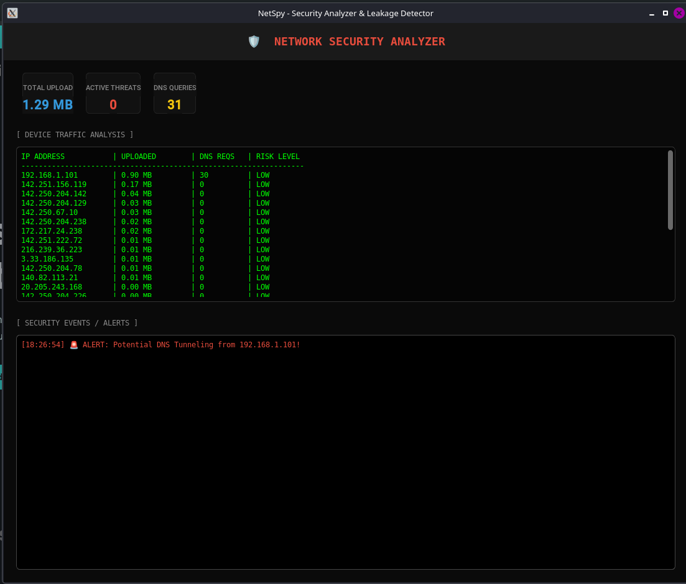

# NetSpy - Network Traffic Monitor & Security Analyzer

NetSpy is a powerful, real-time network packet sniffing and security analysis tool built with Python. It allows users to monitor network traffic, visualize data flow, and detect potential security threats like data leakage and DNS tunneling.

## 🛡️ Key Features

### 1. Real-time Packet Sniffing
- Captures live traffic from any selected network interface (WLAN, Ethernet).
- Categorizes packets by protocols (TCP, UDP, ICMP, ARP).
- Identifies incoming, outgoing, multicast, and broadcast traffic with color-coded logging.

### 2. Deep Packet Inspection (DPI)
- Double-click any packet to view its detailed layer-by-head structure.
- Includes a Hex Dump view for raw payload analysis.
- Visualizes layers from Ethernet to Application protocols.

### 3. Security Analyzer & Leakage Detector (New!)
- **Total Traffic Monitoring:** Tracks total uploaded data across the network.
- **Data Leakage Detection:** Automatically flags any IP sending more than 5MB of data as "CRITICAL".
- **DNS Tunneling Prevention:** Monitors DNS query frequency and alerts on suspicious spikes.
- **Active Threat Dashboard:** A real-time UI showing risk levels (LOW/CRITICAL) for every connected device.

### 4. Advanced Monitoring Mode
- Support for Monitor Mode to capture packets from nearby Wi-Fi networks (for supported hardware).
- Interface management (switching between Managed and Monitor modes).


## 📸 App Screenshots

| Main Dashboard                           | Packet Inspection                             |
|------------------------------------------|-----------------------------------------------|
|  |  |

| Moitor Mode Main UI                           | Advance Monitor Mode                            |
|-----------------------------------------------|-------------------------------------------------|
|  | |

 | Security analyzer                                    | Basic Alert (Developing)       |
|------------------------------------------------------|--------------------------------|
|  |  |

## 🚀 Getting Started

### Prerequisites
- **Python 3.10+**
- **Linux OS** (Ubuntu/Kali/Debian recommended)
- A Wi-Fi adapter that supports **Monitor Mode** 

### 🛠️ Installation

1. **Clone the repository:**
   ```bash
   git clone https://github.com/MehadiWritesCode/NetSpy.git
   cd NetSpy
   
2. **Install System Dependencies:**
  ```bash
  sudo apt-get update && sudo apt-get install libnotify-bin python3-dbus
  ```
3. **Set up Virtual Environment & Install Libraries:**
   ```bash
   python3 -m venv .venv
   source .venv/bin/activate
   pip install -r requirements.txt
   ```
4. **📡 Running the Application:**
   ```bash
   sudo .venv/bin/python3 main.py
   
## 📄 License

This project is licensed under the MIT License - see the [LICENSE](LICENSE) file for details.